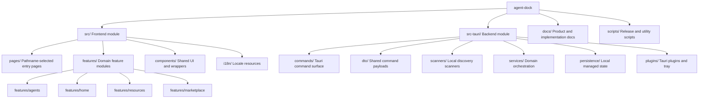

# AgentDock

## Project Overview

AgentDock is a Tauri v2 desktop application for browsing, managing, and composing local AI tooling resources, with the current product focus on agent discovery, skill discovery, and workspace-oriented resource management.

## Architecture

- **Frontend**: React 19 + TypeScript + Vite + Tailwind CSS v4 + shadcn/ui
- **Backend**: Tauri v2 + Rust
- **Tooling**: pnpm, Cargo, ESLint, Prettier
- **Current Focus**: local agent management, skill discovery, resource catalog, desktop workspace flows

## Repository Map



已生成 Mermaid 结构图，便于快速理解根级结构与当前重点模块关系。

## Module Index

| Module | Path | Responsibility | Current Status |
| --- | --- | --- | --- |
| Frontend | `src/` | Desktop UI, feature flows, resource browsing, i18n | Active |
| Backend | `src-tauri/` | Tauri commands, scanners, services, persistence, tray integration | Active |
| Documentation | `docs/` | Product docs, implementation plans, development guides | Active |

## Current Development Focus

1. **Agent discovery and management**: discover local agents, import them into managed state, and render resolved agent views.
2. **Skill discovery**: scan `skills/` folders under managed agent roots, expose summaries/details through Tauri commands, and surface them in the home workspace.
3. **Workspace resource composition**: unify local skills, MCP resources, and subagents inside the home workspace resource browser.
4. **Desktop shell behaviors**: maintain tray menu, updater gating, single-instance behavior, and global shortcut integration.

## Entry Points

- **Frontend entry**: `src/main.tsx`
- **Frontend pages**: `src/pages/home.tsx`, `src/pages/about.tsx`, `src/pages/settings.tsx`
- **Backend entry**: `src-tauri/src/main.rs`
- **Backend runtime wiring**: `src-tauri/src/lib.rs`

## Key Workflows

### Frontend page selection

`src/main.tsx` selects a page component from `window.location.pathname`, so route additions must update the page map instead of introducing a router implicitly.

### Tauri command flow

1. Define DTOs in `src-tauri/src/dto/`
2. Implement orchestration in `src-tauri/src/services/`
3. Implement scanning or persistence helpers in `src-tauri/src/scanners/` or `src-tauri/src/persistence/`
4. Expose command handlers in `src-tauri/src/commands/`
5. Register commands in `src-tauri/src/lib.rs`
6. Invoke from `src/features/**/api.ts`

### Resource workspace flow

Managed agents are resolved first, then their `skills/` directories are transformed into skill scan targets and displayed alongside other local resource types in the home workspace.

## Development Commands

```bash
pnpm install
pnpm dev
pnpm tauri dev
pnpm build
pnpm tauri build
pnpm format
pnpm lint
pnpm check
```

## Collaboration Rules

### Global coding rules

1. All comments, logs, and user-facing error strings added in code must stay in English.
2. Keep implementations direct and minimal; avoid speculative abstraction.
3. Prefer editing feature-layer code over modifying generated shadcn wrappers in `src/components/ui/`.
4. Do not change source code under the guise of documentation updates.

### Frontend rules

- Use `@/` imports for files inside `src/`.
- Keep domain logic inside `src/features/` before adding new top-level utility layers.
- Reuse current workspace/resource patterns when extending home page capabilities.
- Treat `src/components/ui/` as generated wrappers; adapt usage outside that directory.

### Backend rules

- Use `#[tauri::command]` for frontend-facing commands.
- Keep command modules thin; move orchestration into services.
- Keep file-system discovery in scanners and durable state in persistence.
- When adding new command families, update `commands/mod.rs`, `dto/mod.rs`, `services/mod.rs`, `scanners/mod.rs`, and `src/lib.rs` together.

## Module Navigation

- Frontend details: `src/CLAUDE.md`
- Backend details: `src-tauri/CLAUDE.md`
- Product and implementation context: `docs/`

## Documentation Notes

The `docs/` directory already contains implementation plans and development guides for subagents, MCP, skills, and local agent discovery. Prefer updating existing guides before adding new top-level docs.

## Scope Boundaries for AI Assistance

- Root `CLAUDE.md` should stay concise and high-level.
- Module-specific interfaces, files, and workflows belong in module-level `CLAUDE.md` files.
- If a module evolves significantly, update the relevant local `CLAUDE.md` instead of overloading this root file.
