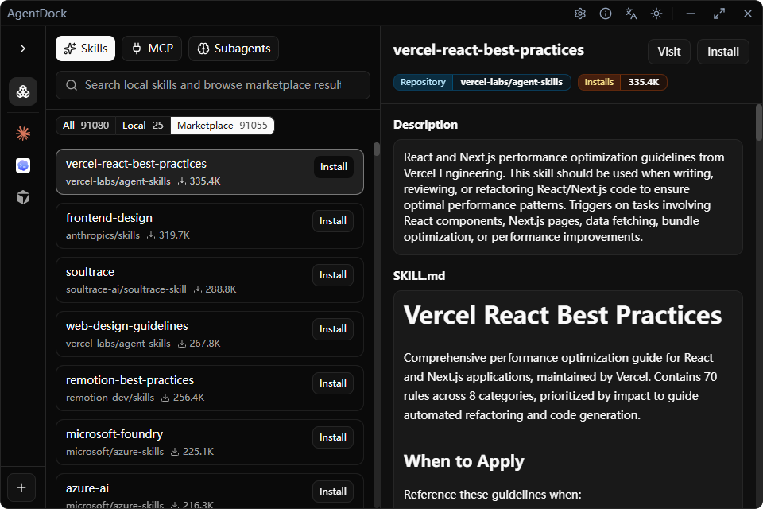

<div align="center">

# AgentDock

English | [简体中文](./README.zh-CN.md)

[](https://tauri.app/)
[](https://react.dev/)
[](https://www.typescriptlang.org/)
[](./LICENSE)

A desktop application for browsing, managing, and composing local AI tooling resources across multiple agent ecosystems.

</div>

## Preview



## Features

- 🤖 **Local Agent Management** - Discover, import, create, remove, and inspect local AI agents from different tooling ecosystems
- 🧩 **Skill Discovery And Maintenance** - Scan `skills/` and `commands/`, inspect details, enable or disable skills, open files, delete, and copy across agents
- 🛒 **Skill Marketplace Integration** - Browse, search, inspect, install, and update marketplace-backed skills through `skills.sh`
- 🔌 **Local MCP Management** - Discover and manage local MCP servers for `Claude Code`, `Codex CLI`, `Gemini CLI`, and `OpenCode`
- 📥 **MCP JSON Import** - Paste MCP JSON, preview conflicts, and import config into supported local agent runtimes
- 🏠 **Unified Home Workspace** - Work from a single `Home / Agents` experience instead of separate resource pages
- 🔔 **Desktop Shell Behavior** - System tray, global shortcuts, single-instance behavior, and updater-ready desktop flows
- 🌍 **Internationalization** - i18next integration with English and Chinese support

## Tech Stack

- **Desktop Framework**: [Tauri v2](https://tauri.app/)
- **Frontend Framework**: [React 19](https://react.dev/) + [TypeScript](https://www.typescriptlang.org/)
- **Build Tool**: [Vite](https://vite.dev/)
- **UI Components**: [shadcn/ui](https://ui.shadcn.com/)
- **Styling**: [Tailwind CSS v4](https://tailwindcss.com/)
- **Code Formatting**: [Prettier](https://prettier.io/)

## Getting Started

### Prerequisites

- Node.js >= 18
- pnpm >= 9
- Rust >= 1.70

### Install Dependencies

```bash
pnpm install
```

### Development Mode

```bash
pnpm tauri dev
```

### Build for Production

```bash
pnpm tauri build
```

### Version Management

`pnpm release:version` is the release entrypoint.

```bash
pnpm release:version
pnpm release:version --lang zh
pnpm release:version --lang en
```

It interactively handles the release preflight and version bump flow:

- Ensures the working tree is clean
- Requires the current branch to be `main`
- Verifies `package.json`, `src-tauri/tauri.conf.json`, and `src-tauri/Cargo.toml` are in sync
- Checks that the target tag does not already exist locally or on `origin`
- Updates all three version files together
- Creates the release commit and `vX.Y.Z` tag
- Optionally pushes the branch and tag

## Adding shadcn/ui Components

```bash
pnpm dlx shadcn@latest add <component-name>
```

Examples:

```bash
pnpm dlx shadcn@latest add button
pnpm dlx shadcn@latest add input
pnpm dlx shadcn@latest add dialog
```

## Code Formatting

```bash
pnpm format        # Format code
pnpm format:check  # Check code formatting
```

## Quality Checks

```bash
pnpm lint
pnpm build
cargo fmt --check --manifest-path src-tauri/Cargo.toml
cargo check --manifest-path src-tauri/Cargo.toml
```

## Project Structure

```
.
├── src/                           # Frontend source code
│   ├── components/                # Shared React components
│   │   └── ui/                    # shadcn/ui wrappers
│   ├── features/                  # Domain features
│   │   ├── agents/                # Agent discovery and management
│   │   ├── home/                  # Workspace flows and resource browser
│   │   ├── marketplace/           # skills.sh integration
│   │   └── resources/             # Shared resource rendering
│   ├── i18n/                      # Internationalization
│   ├── pages/                     # Window pages
│   └── main.tsx                   # Frontend entry and pathname-based page selector
├── src-tauri/                     # Tauri/Rust backend
│   ├── src/commands/              # Tauri command surface
│   ├── src/scanners/              # Local discovery scanners
│   ├── src/services/              # Domain orchestration
│   ├── src/persistence/           # Local managed state
│   └── tauri.conf.json            # Tauri configuration
├── docs/                          # Product and implementation docs
├── components.json                # shadcn/ui configuration
└── package.json
```

## CI/CD

This project uses GitHub Actions for automated builds and releases.

### Automated Release

The workflow is triggered by pushing tags matching `v*` (for example `v0.1.0`).
The recommended release path is to run `pnpm release:version`, which creates the matching `vX.Y.Z` tag for you.

**Manual tag push example:**

```bash
git tag v0.1.0
git push origin v0.1.0
```

### Build Outputs

The workflow generates:

- **NSIS Installer** - Windows installation package
- **Updater Files** - `latest.json` for auto-update support

### Auto Update Setup

To enable automatic updates, you need to:

1. Generate signing keys: `pnpm tauri signer generate -w ~/.tauri/myapp.key`
2. Add GitHub secrets: `TAURI_SIGNING_PRIVATE_KEY` and `TAURI_SIGNING_PRIVATE_KEY_PASSWORD`

**Note:** The public key and update endpoint placeholders in `src-tauri/tauri.conf.json` are replaced by GitHub Actions during the release build. Auto update depends on the published GitHub Release exposing `latest.json` from the latest release assets.

See [Auto Update Configuration](./docs/AUTO_UPDATE.md) for detailed instructions.

### Code Signing (Optional)

To enable code signing, add these secrets in your GitHub repository settings:

- `TAURI_SIGNING_PRIVATE_KEY` - Private key content
- `TAURI_SIGNING_PRIVATE_KEY_PASSWORD` - Private key password

The build will work without these secrets, but the installer won't be signed.

### Multi-Platform Support

To enable macOS and Linux builds, uncomment the corresponding platform configurations in `.github/workflows/release.yml`.

## Recommended IDE Setup

- [VS Code](https://code.visualstudio.com/)
- [Tauri](https://marketplace.visualstudio.com/items?itemName=tauri-apps.tauri-vscode)
- [rust-analyzer](https://marketplace.visualstudio.com/items?itemName=rust-lang.rust-analyzer)

## Star History

[](https://star-history.com/#kitlib/agent-dock&Date)

## License

MIT
